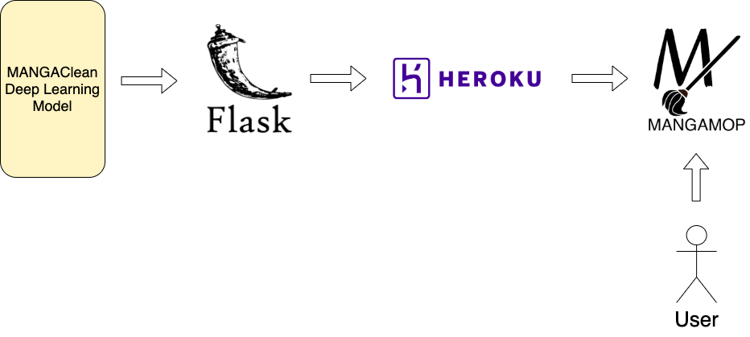

# Mangamop
Automated Manga Cleaning Web Application using a Deep Learning Pix2Pix Model. 

## Training the Model 
The deep learning model, named MANGAClean, uses the PyTorch implementation of the pix2pix GAN network, forked from pytorch-CycleGAN-and-pix2pix. The goal of training this model is to convert raw dirty scans of manga pages into high-quality, denoised images, and to effectively automate the cleaning process in manga scanlation procedures.

Check out https://github.com/justkhant/pytorch-MANGAClean for more information about training the deep learning model, as well as more background about manga cleaning procedures.

## Plan
After training the MANGAClean model, the plan is the create a website where users can upload images of low quality, raw manga scans, and receive clean, denoised versions of the manga pages as output. Below is the high level architecture diagram of the project:

 

 * Write the web app in Python with Flask as the framework.
 * Deploy the web app on the Heroku Cloud Platform. 

## Web App (In Progress) 
This section will be updated with snapshots of the website, as well as the link to it after it is deployed.
 
